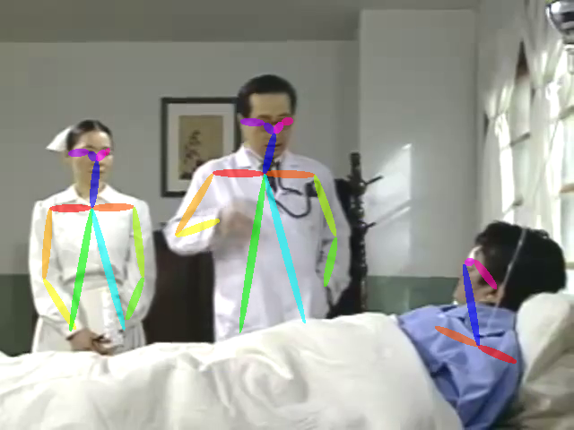

# PoseNet

Modifications from https://github.com/JustinShenk/video-pose-extractor


### Requirements
* Download pre-trained model into `src/model/`. see `src/config`.
 - https://github.com/ZheC/Realtime_Multi-Person_Pose_Estimation


### Run
```julia
using PoseNet
m = prepare()
getpose(m, "examples/dr/dr_001.png")
```



```julia
using Glob
getpose(m, glob("examples/dr/*"))
```


* use GPU
```julia
m = prepare(gpu=true)
```
